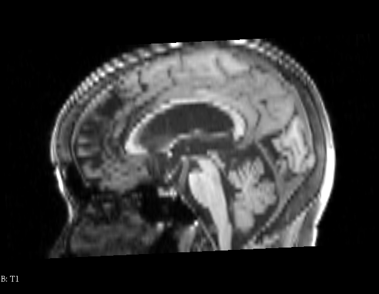
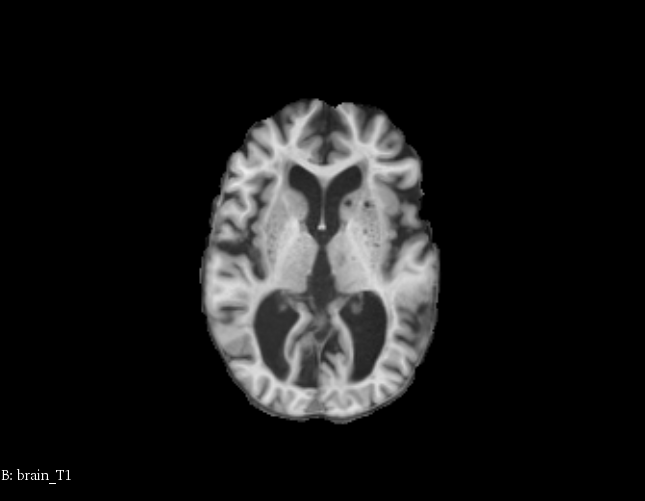
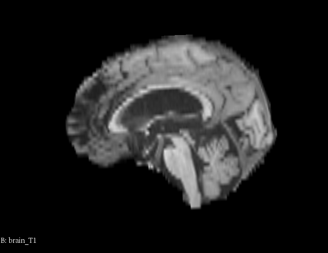
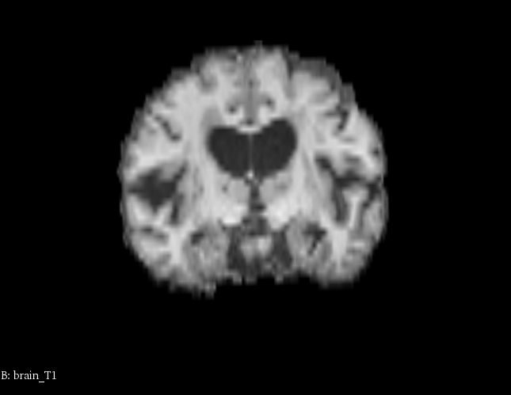
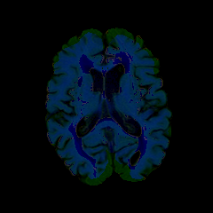
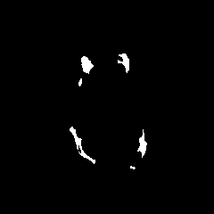

# WhiteMatterHyperintensities

White matter hyperintensity segmentation using a 2D U-Net. Keras with Tensorflow backend.

Currently working on modifications and improvements

## Brain extraction:

Using BET-FSL

Axial view             |  Sagital view          | Coronal view 
:-------------------------:|:-------------------------:|:-------------------------:
  |  |  
  |  |  

## Normalization:

All slices where shaped to (240, 240)

###### Pixel intensity normalization:

$$
norm(x) = 
			\begin{cases}				
				0.0, & \ \ \ \ if \ \  x \leq P_{5} \\
				1.0, & \ \ \ \ if \ \  x \geq P_{95} \\				
				\frac{x - min}{max - min}, & \ \ \ \ otherwise
			\end{cases}
$$

## Data augmentation:

| Shifts                                       | Rotations   |
| -------------------------------------------- | ----------- |
| X axis: [-0.3, 0.3] Y axis: [-0.3, 0.3] | [-15º, 15º] |

## T1, FLAIR and FLAIR's top-hat as a 3 channel image input for the network

## Training:

### Weight initialization

Based on a Gaussian kernel of $ stdv = \frac{2}{\sqrt{N}} $

### Loss function

Dice Similarity Coefficient Loss over N slices where $ N = batch\_size  $

$$ DSCLoss = - \frac{\sum_{n = 1}^{N} | g_{n} \circ \ p_{n} |}{\sum_{n = 1}^{N} |g_{n}| + |p_{n}|} $$

### Optimizer: Adam (Keras implementation)

### Hyperparameters:

- Batch size: 30
- Learning rate: 0.000001

## Results

           Input image           |         Ground truth         |            Prediction             
:-------------------------:|:-------------------------:|:-------------------------:
  |  |  

           Input image           |         Ground truth         |            Prediction             
:-------------------------:|:-------------------------:|:-------------------------:
  |  |  

#### Validation DSC = 0.6494

## References summary

- Olaf Ronneberg, Philipp Fischer and Thomas Brox, *U-Net: Convolutional Netowrks for Biomedical Image Segmentation*, University of Freiburg, Germany, 2015.
- Yongchao Xu, Thierry Géraud, Elodie Puybareau, Isabelle Bloch and Joseph Chazalon.
  *White Matter Hyperintensities Segmentation Using Fully Convolutional Network and Transfer Learning*, 2017.
- M. Rincón, E Díaz-Lopez, P. Selnes, K. Vegge, M. Altman, T. Fladby and A.Bjornerud.  *Improved Automatic Segmentation of White Matter Hyperintensities in MRI Based on Multilevel Lesion Features.*, UNED, Madrid, Spain. 2017.
- Hongwei Li, Gongfa Jiang, Ruixuan Wang, Jianguo Zhang, Zhaolei Wang, Wei-Shi Zheng1 and Bjoern Menze. *Fully Convolutional Network Ensembles for White Matter Hyperintensities Segmentation in MR Images*, 2018.
- Fausto Milletari, Nassir Navab, Seyed-Ahmad Ahmadi, *V-Net: Fully Convolutional Neural Networks for Volumetric Medical Image Segmentation*, 2016.
- S.M. Smith, M. Jenkinson, M.W. Woolrich, C.F. Beckmann, T.E.J. Behrens, H. Johansen-Berg, P.R. Bannister, M. De Luca, I. Drobnjak, D.E. Flitney, R. Niazy, J. Saunders, J. Vickers, Y. Zhang, N. De Stefano, J.M. Brady, and P.M. Matthews. *Advances in functional and structural MR image analysis and implementation as FSL*. NeuroImage, 23(S1):208-19, 2004